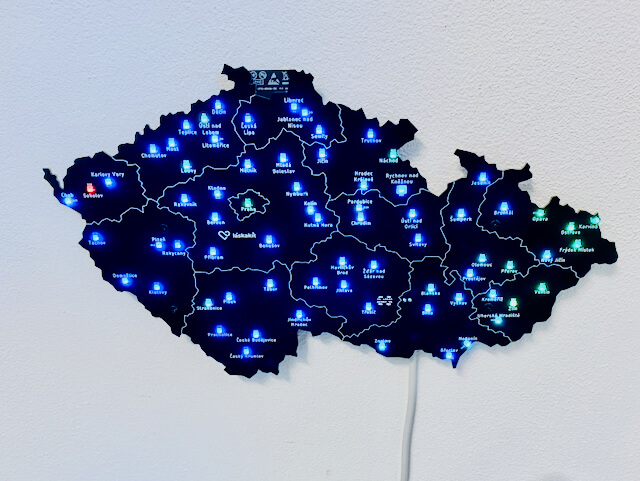
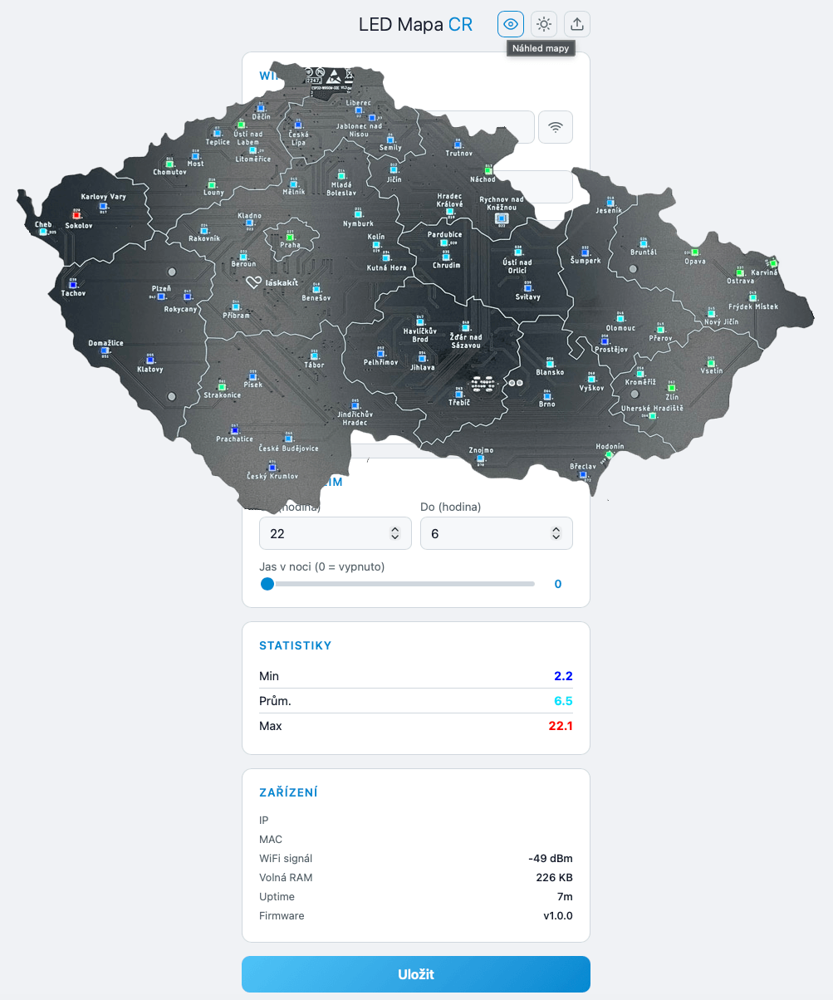
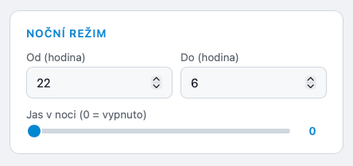
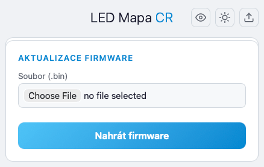
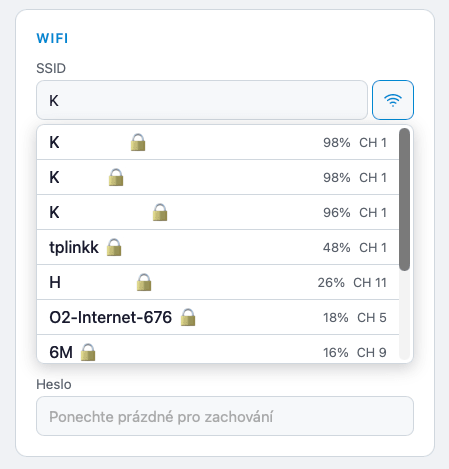
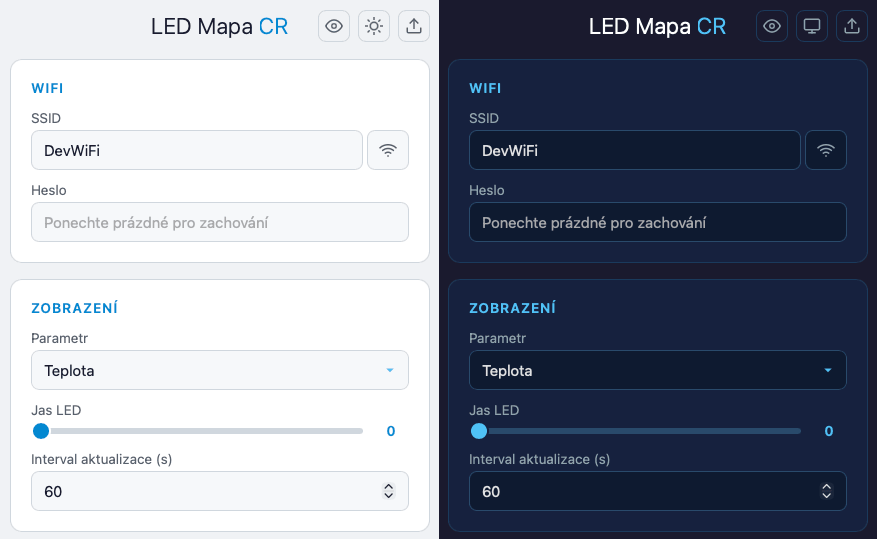
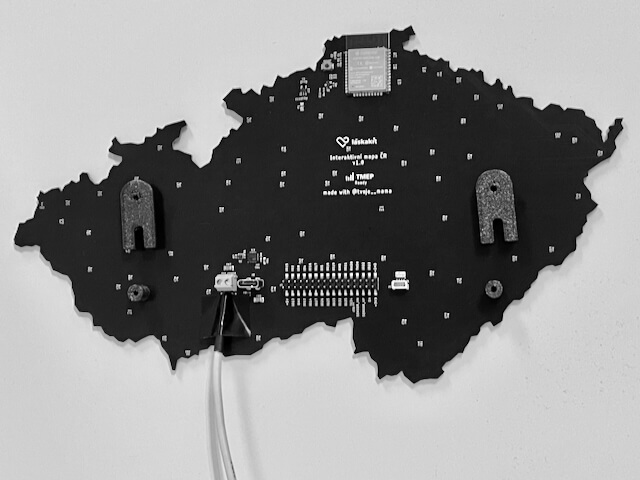

# LaskaKit Interaktivní Mapa ČR — rozšířený firmware

Fork originálního
firmware [TMEP_Meteoradar_Config_WEB_Portal](https://github.com/LaskaKit/LED_Czech_Map/blob/main/SW/TMEP_Meteoradar_Config_WEB_Portal/TMEP_Meteoradar_Config_WEB_Portal.ino)
pro [LaskaKit Interaktivní mapu ČR](https://www.laskakit.cz/laskakit-interaktivni-mapa-cr-ws2812b/) s 72 adresovatelnými
WS2812B LED diodami na ESP32.




Firmware zobrazuje data z [tmep.cz](https://tmep.cz) — teplotu, vlhkost, tlak, prašnost a meteoradar — pomocí barevné
škály na fyzické mapě České republiky.

## Novinky oproti originálu

### Náhled mapy ve webovém rozhraní

- Interaktivní náhled mapy ČR s 72 LED body přímo v prohlížeči
- Zobrazuje aktuální data ze senzorů ve stejné barevné škále jako fyzická mapa
- Každá LED ukazuje název okresu v tooltipu
- Podpora meteoradaru i klimatických dat



### Noční režim

- Nastavitelný časový rozsah (např. 22:00–6:00) s automatickým rozpoznáním přechodu přes půlnoc
- Volitelný snížený jas v noci, nebo úplné vypnutí LED (jas = 0)
- Synchronizace času přes NTP (timezone CET/CEST)
- Originální firmware tuto funkci nemá



### OTA aktualizace firmware

- Nahrání nového firmware přímo přes webové rozhraní (soubor `.bin`)
- Progress bar s procentuálním ukazatelem průběhu
- Automatický restart a znovunačtení stránky po úspěšném nahrání
- V adresáři `bin/` je předkompilovaný `firmware.bin` pro přímé flashnutí



### Skenování WiFi sítí

- Tlačítko pro vyhledání dostupných WiFi sítí přímo z konfigurační stránky
- Zobrazení SSID, síly signálu (%), kanálu a typu zabezpečení
- Výběr sítě kliknutím — automatické vyplnění SSID



### Dark / Light theme

- Kompletně přepracované rozhraní jako single-page aplikace (SPA)
- Tři režimy motivu: **tmavé** (dark), **světlé** (light) a **systémové** (automaticky dle nastavení OS)
- Přepínání motivu tlačítkem přímo v hlavičce stránky
- Originální firmware má pouze jednoduchý světlý formulář bez možnosti změny



### API endpointy

Firmware poskytuje REST API pro integraci s dalšími systémy:

| Endpoint          | Metoda   | Popis                                |
|-------------------|----------|--------------------------------------|
| `/api/config`     | GET/POST | Čtení/zápis konfigurace              |
| `/api/stats`      | GET      | Min/průměr/max aktuálních dat        |
| `/api/info`       | GET      | IP, MAC, RSSI, RAM, uptime, verze FW |
| `/api/okresy`     | GET      | Proxy na klimatická data tmep.cz     |
| `/api/srazky`     | GET      | Proxy na data meteoradaru            |
| `/api/wifi-scan`  | GET      | Seznam dostupných WiFi sítí          |
| `/api/ota-update` | POST     | Upload firmware                      |

### Detekční a chybové stavy

- **Automatický reconnect WiFi** — při výpadku se firmware pokusí znovu připojit
- **Blikání LED Prahy červeně** — vizuální indikace chybového stavu (WiFi/data)
- **Fallback do AP módu** — při neúspěchu připojení automaticky spustí konfigurační Access Point

### Vylepšení firmware

- PlatformIO projekt místo Arduino IDE — snadná kompilace přes `pio run`
- Modulární struktura — HTML šablony v `web/`, build skript automaticky embeduje do PROGMEM
- Vývojový server (`scripts/dev_server.py`) pro testování webového rozhraní na PC bez ESP32
- Verzování firmware (`version.h`) — verze se zobrazuje ve webovém rozhraní
- `mapFloat()` místo Arduino `map()` pro přesnější mapování barvy (float)
- Constrain na vstupní hodnoty (jas 0–255, interval 10–3600 s)
- Cachované statistiky — nepočítají se při každém HTTP požadavku, ale při načítání dat

## Hardware

### Mapa

[LaskaKit Interaktivní mapa ČR WS2812B](https://www.laskakit.cz/laskakit-interaktivni-mapa-cr-ws2812b/) — deska s 72
adresovatelnými RGB LED diodami rozloženými po mapě České republiky.

### Napájení

Napájení přes externí zdroj připojený
na [šroubovací svorkovnici KF128 2.54](https://www.laskakit.cz/sroubovaci-svorkovnice-do-dps-kf128-2-54/?variantId=8868)
připájenou na desku mapy. Průměrná spotřeba je cca 120 mA při jasu 10.

### Držák na zeď

Součástí projektu je 3D tiskový model držáku (`hw/mapa-cr.3mf`) umožňující zavěšení mapy na zeď pomocí háčků do
omítky [TWENTY Mini M0 (Hornbach)](https://www.hornbach.cz/p/hacek-twenty-mini-m0-blistr-bily/5036441/).



## Kompilace a nahrání

Projekt používá [PlatformIO](https://platformio.org/):

```bash
# Kompilace
pio run

# Kompilace a nahrání na ESP32
pio run -t upload

# Sériový monitor (115200 Bd)
pio device monitor

# Vše naráz
pio run -t upload && pio device monitor
```

Alternativně lze použít OTA aktualizaci přes webové rozhraní — stačí nahrát soubor `bin/firmware.bin`.

## První spuštění

1. Po naprogramování ESP32 vytvoří WiFi síť **LaskaKit-MapaCR**
2. Připojte se k této síti a otevřete **192.168.4.1** v prohlížeči
3. Zadejte SSID a heslo vaší domácí WiFi sítě a uložte
4. Po restartu se mapa připojí k WiFi a začne zobrazovat data
5. IP adresu zjistíte z routeru nebo sériového monitoru (115200 Bd)

## Vývojový server

Pro vývoj a testování webového rozhraní bez ESP32:

```bash
python3 scripts/dev_server.py
```

Server běží na `http://localhost:8090/`, proxuje data z tmep.cz a simuluje API endpointy.

## Struktura projektu

```
src/main.cpp           — hlavní firmware
web/config.html        — zdrojová HTML stránka (SPA)
web/mapa.png           — obrázek mapy pro náhled
include/html_templates.h — auto-generovaný embed HTML do PROGMEM
include/version.h      — verze firmware
include/mapa_png.h     — embed PNG do PROGMEM
scripts/embed_html.py  — PlatformIO pre-build skript
scripts/dev_server.py  — lokální vývojový server
hw/mapa-cr.3mf         — 3D model držáku na zeď
bin/firmware.bin        — předkompilovaný firmware
platformio.ini         — konfigurace PlatformIO
```

## Licence

Založeno na originálním firmware [LaskaKit LED Czech Map](https://github.com/LaskaKit/LED_Czech_Map) (LaskaKit, 2025).
